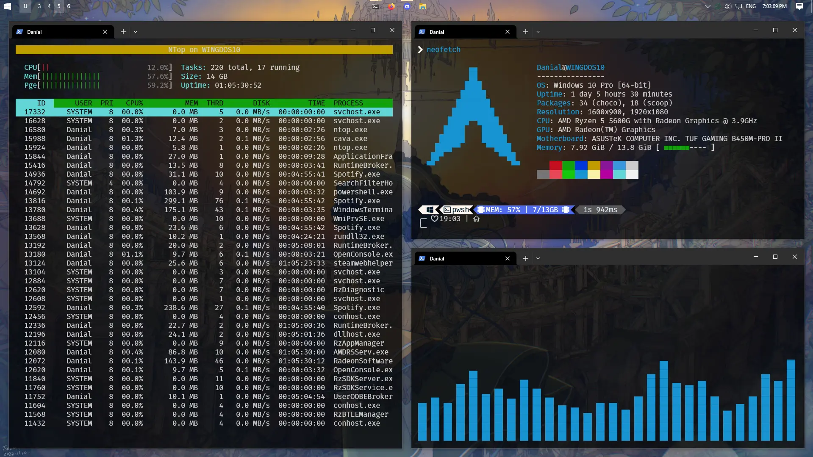

# My Windows 10 dual monitor dotfiles



## Installation

### 1. Install [scoop](https://scoop.sh/) first if you haven't

```pwsh
Set-ExecutionPolicy -ExecutionPolicy RemoteSigned -Scope CurrentUser
Invoke-RestMethod -Uri https://get.scoop.sh | Invoke-Expression
```

### 2. Install

```pwsh
# Add Extras bucket
scoop bucket add extras

# Install packages
scoop install glazewm taskbarx winfetch ntop

# Copy configs to user profile folder
cp -r .config ~
cp -r .glaze-wm ~

# Install cava
cp -r cava ~/AppData/Local/Programs
scoop shim add cava ~/AppData/Local/Programs/cava/cava.exe
```

### 3. Open `TaskbarX Configurator`

- TaskbarX Configurator
  - Style
    - [x] Transparent
  - Startup
    - [x] Create

### 4. Open `Taskbar settings`

- Taskbar settings
  - [x] Use small taskbar buttons
  - Taskbar location on screen
    - [x] Top
